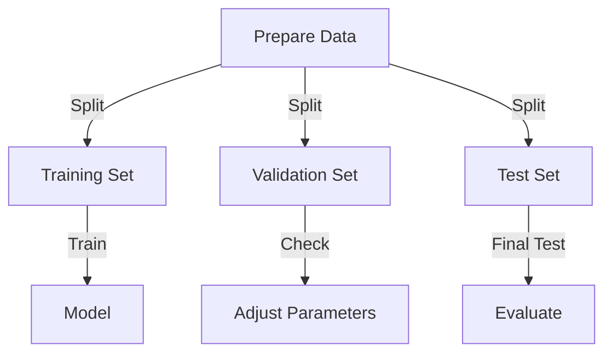

# bert-base-uncased Tutorial Project

This repository demonstrates various approaches to intent classification and NLP using Hugging Face Transformers, scikit-learn, and integration with external data sources like PostgreSQL. It includes scripts for training models on CSV and JSON data, using pretrained pipelines, and training directly from a database.

## Table of Contents
- [Installation](#installation)
- [Project Structure](#project-structure)
- [Python Scripts Explained](#python-scripts-explained)
- [Other Files](#other-files)
- [License](#license)

## Project explanation

### main.py
Demonstrates the use of Hugging Face's pretrained pipelines for sentiment analysis and intent classification. It loads a sentiment analysis pipeline and an intent classification pipeline, runs them on a sample sentence, and prints the results.

### json_custom_model.py
Trains a custom intent classification model using Hugging Face Transformers, reading data from a JSON file with 'text' and 'label' fields. The script:
- Loads and preprocesses the data
- Tokenizes the text
- Sets up and fine-tunes a transformer model
- Evaluates and saves the model and tokenizer

### csv_custom_model.py
Similar to `json_custom_model.py`, but reads the dataset from a CSV file with 'text' and 'label' columns. The workflow is otherwise identical: data loading, preprocessing, tokenization, model training, evaluation, and saving.

### train_postgres.py
Connects directly to a PostgreSQL database, loads the `camera_events` table, cleans and featurizes the data using external preprocessing utilities (assumed to be available in your environment), trains a RandomForestClassifier, and saves the trained model. Update the database credentials at the top of the script before use.

## Other Files

### requirements.txt
Lists the core dependencies: `transformers`, `torch`, and `scikit-learn`. For database integration, add `sqlalchemy` and `psycopg2-binary`.

### training-process.mmd
A Mermaid diagram describing the typical machine learning training workflow: data preparation, splitting, training, validation, and evaluation.

### cursor_using_train_random_forest_for_in.md
A transcript or documentation file, possibly exported from a code assistant session, containing Q&A and explanations about model choices and implementation details.

## License
MIT

Test PR4 - add some more comments
add some more comments for new commit
------
test is 5th test
----
test is 6th test